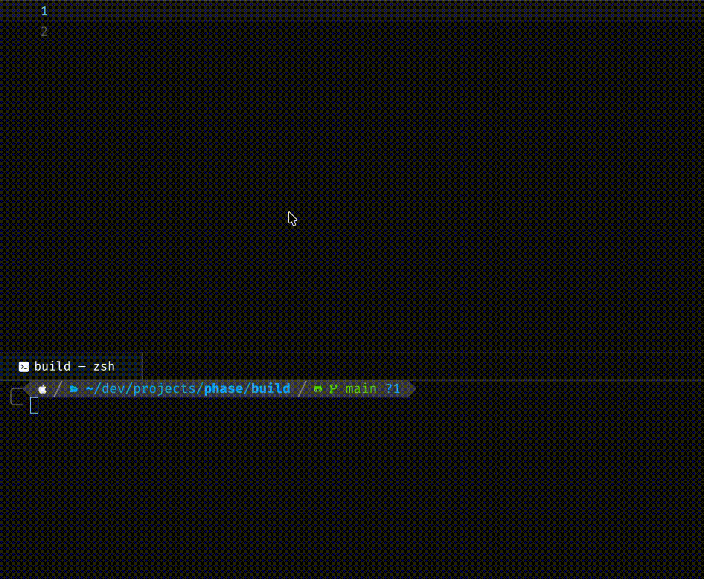
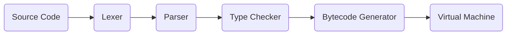

<h1 align="center">Phase</h1>
<h3 align="center">A statically-typed language bridging high-level clarity with low-level control</h3>

<div align="center">
    <br/><br/>
    &nbsp;&nbsp;
    &nbsp;&nbsp;
    &nbsp;&nbsp;
    &nbsp;&nbsp;
    &nbsp;&nbsp;
    
</div>
<br/>

<h3 align="center">For detailed insight into the development of Phase, read my <a href="https://williamalexakis.com/blog/posts/writing-phase">blog post</a>.</h3>

## Features

- Supports functions, conditionals, loops (`while`), tuple destructuring.
- 5 primitive types (`str`, `int`, `float`, `bool`, and `void`).
- 21 error types with detailed diagnostics including visual markers and diff-style fix suggestions.
- Implemented fully in C17.

## Architecture

### Interpreter Pipeline



## Virtual Machine

Phase compiles programs into bytecode, executed by a handwritten stack-based VM supporting 25 opcodes.

**So this source code**:
```c
entry {
    out("Hello world!")
}
```
**Will compile into this bytecode**:
```c
00 00 00   ; OP_PUSH_CONST 0
01         ; OP_PRINT
18         ; OP_HALT
```

## Installation

### Prerequisites

- **CMake 3.20+**
- **Compiler that supports C17**

### Building

1. **Clone the repo:**
    ```bash
    git clone https://github.com/williamalexakis/phase.git
    cd phase
    ```

2. **Run the automated build script**:
    
    Quick Build
    ```bash
    ./build.sh
    ```
    
    Run with `--debug` for the Debug Build or `--run` to immediately run after building.
        
    **Or build it manually:**
    ```bash
    mkdir build
    cd build
    cmake ..
    cmake --build .
    ```
    
## Usage

| Command | Description |
|--------|-------------|
| `phase --help` | Display available commands and flags |
| `phase <file.phase> --tokens` | Display token stream |
| `phase <file.phase> --ast` | Display AST |
| `phase <file.phase> --loud` | Display a success message when programs finish |

## Syntax Examples

### Hello World
```c
entry {
    out("Hello world!")
}
```

### Variables
```c
entry {
    let (var1, var2): str = ("Hello", "World")
    let var3: bool = true
    let var4: int = 1
    let var5: float = 1.0
}
```

### Functions and Logic
```c
func add(num1: int, num2: int): void {
    out(num1 + num2)
}

entry {
    add(5, 5)
}
```

### Conditionals and Arithmetic
```c
entry {
    let score: int = 9

    if score >= 10 {
        out("Excellent")
    } else if score > 5 {
        out("Good")
    } else {
        out("Bad")
    }
}
```

### Loops (while)
```c
entry {
    let counter: int = 0
    
    while counter < 11 {
        out(counter)
        counter += 1
    }
}
```

#### See `examples/` for more

## Diagnostics Examples

### Error Reporting


### Token Display


### AST Display


## Roadmap

- [x] Lexer
- [x] Parser
- [x] Bytecode generator
- [x] VM execution loop
- [x] Token and AST diagnostics
- [x] Floats and booleans
- [x] Error manager
- [x] Declaration keywords & annotations
- [x] Functions
- [x] Conditionals
- [x] Basic loops

## License

Phase is released under the MIT License.

See the `LICENSE` for full details.
