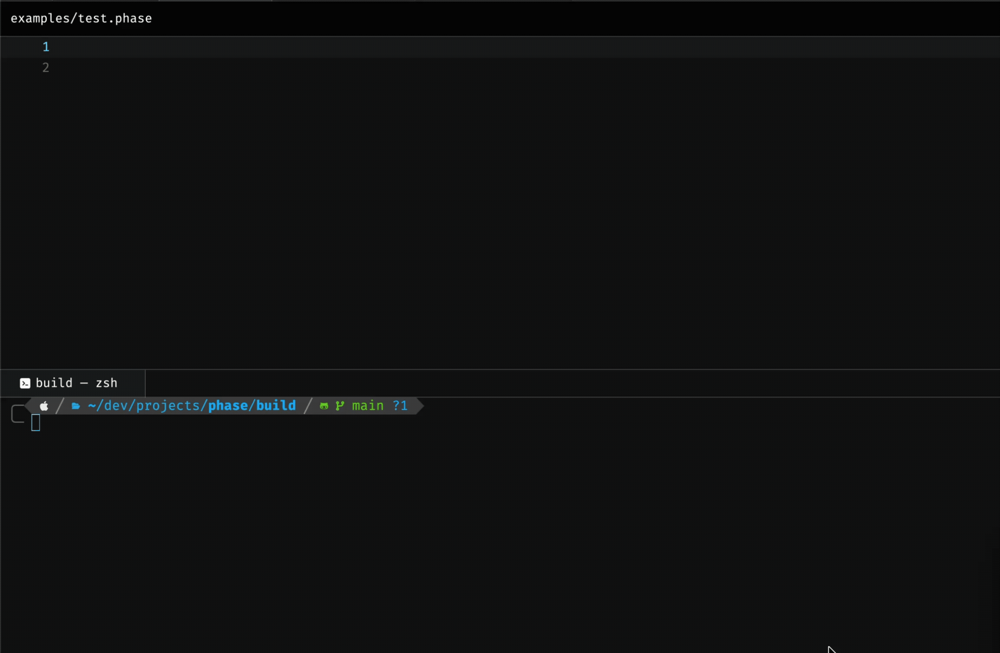
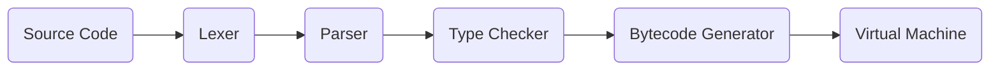
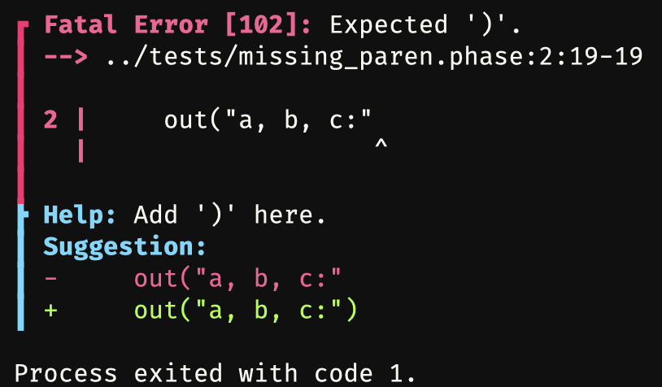
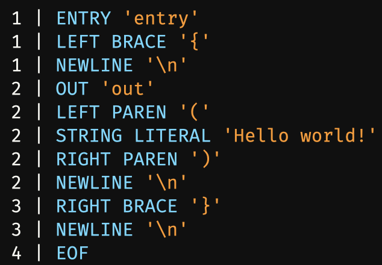
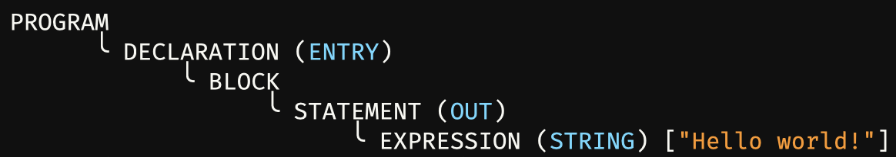

<h1 align="center">Phase</h1>
<h3 align="center">A statically-typed language bridging high-level clarity with low-level control</h3>

<div align="center">
    <br/><br/>
    &nbsp;&nbsp;
    &nbsp;&nbsp;
    &nbsp;&nbsp;
    &nbsp;&nbsp;
    &nbsp;&nbsp;
    
</div>

> [!NOTE]
> Phase is a functional prototype language. It is designed for clarity and experimentation rather than production deployment.

## Features

- **Clean Semantics** – Syntax is clear, balanced, and predictable.
- **Static Typing** – Variable declarations have consistent syntax and type safety is ensured through compile-time checking.
- **Bytecode Compilation** – Source code is compiled into a portable instruction set executed by a fast handwritten VM.
- **Error Manager** – Errors are handled by a diagnostic system that displays clear and informative reports.
- **Debug Modes** – Token streams and AST structures are easily viewable for effective diagnostics of source code.

## Motivation

I created Phase to bridge a gap between high-level languages and low-level ones.
High-level languages are expressive but obscure their mechanics, while low-level languages are explicit but heavy; I wanted a middleground that's clear, predictable, and simple.

I also spent time designing an error system that tells you exactly what you need to know – without excessive noise or missing context. I think that good diagnostics are as important as good semantics, and I wanted Phase to reflect that.

## Architecture

### Interpreter Pipeline


### Project Structure
```txt
phase/
  ├─ src/
  │   ├─ lexer.c
  │   ├─ lexer.h
  │   ├─ parser.c
  │   ├─ parser.h
  │   ├─ codegen.c
  │   ├─ codegen.h
  │   ├─ errors.c
  │   ├─ errors.h
  │   ├─ main.c
  │   └─ colours.h
  ├─ examples/
  │   ├─ helloworld.phase
  │   └─ variables.phase
  ├─ tests/
  │   ├─ invalid_token_global.phase
  │   ├─ missing_expression.phase
  │   ├─ missing_paren.phase
  │   ├─ multiple_entry.phase
  │   ├─ no_entry.phase
  │   ├─ open_string.phase
  │   ├─ type_mismatch.phase
  │   ├─ undefined_var.phase
  │   └─ wrong_var_init_count.phase
  ├─ CMakeLists.txt
  ├─ build.sh
  ├─ LICENSE
  └─ README.md
```

## Installation

### Prerequisites

- **CMake 3.20+**
- **C17-compatible compiler**

### Building

1. **Clone the repo in your desired directory:**
    ```bash
    git clone https://github.com/williamalexakis/phase.git
    cd phase
    ```

2. **Run the Automated Build Script (Recommended)**:
    
    Quick Build
    ```bash
    ./build.sh
    ```
    
    Run with `--debug` for Debug Build or `--run` to immediately run after building.
        
    **Or Build Manually:**
    ```bash
    mkdir build
    cd build
    cmake ..
    cmake --build .
    ```
    
## Usage

| Command | Description |
|--------|-------------|
| `phase --help` | Display available commands and flags |
| `phase <file.phase> --tokens` | Display token stream |
| `phase <file.phase> --ast` | Display AST |
| `phase <file.phase> --loud` | Display a success message when programs finish |

## Syntax Examples

### Hello World
```c
entry {
    out("Hello world!")
}
```

### Variables
```c
entry {
    str (name, surname) = ("Arthur", "Ford")
    int age = 25
    bool employed = true
    
    out("Name:")
    out(name)
    out(surname)
    out("Age:")
    out(age)
    out("Employed:")
    out(employed)
}
```

#### See `examples/` for more

## Output Examples

### Error Reporting


### Token Display


### AST Display


## Roadmap

- [x] Lexer
- [x] Parser
- [x] Bytecode generator
- [x] VM execution loop
- [x] Token and AST diagnostics
- [x] Floats and booleans
- [x] Error manager
- [ ] Arena allocator
- [ ] Functions
- [ ] Conditionals
- [ ] Basic loops

## Contributing

Contributions and suggestions are welcome. Please open an issue before submitting large changes.

## License

Phase is released under the MIT License. See the LICENSE for full details.
